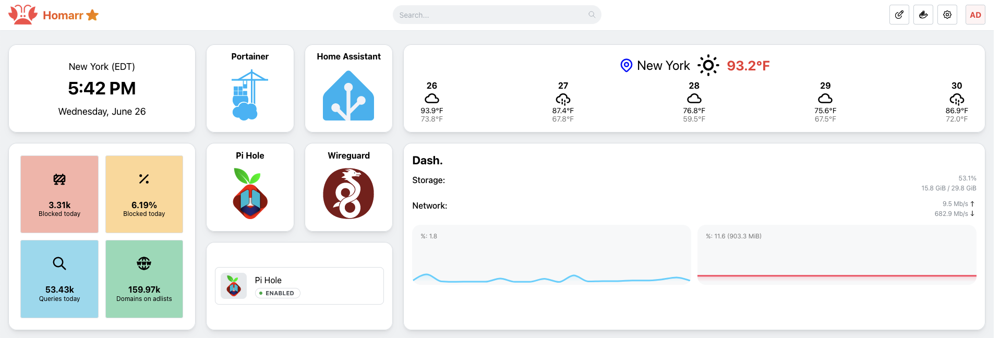

# raspberry-pi-portainer


My custom Raspberry Pi Portainer setup and configuration. 

## Setup

Execute the following command:

```
sudo raspi-config
```

To turn on the following
- Interfaces > VNC > Enable
- System Options > Network at Boot > Yes
- Display Options > VNC Resolution > Highest
- Update

Set the Raspberry Pi's [Static IP Address](https://www.tomshardware.com/how-to/static-ip-raspberry-pi)

### Install Vim

```
sudo apt install vim
```

### Install Firefox

Execute the following line:

```
sudo apt install firefox-esr
```

### Update and Upgrade Raspberry Pi

Execute the following commands:

```
sudo apt-get update
sudo apt full-upgrade
sudo reboot
```

## Setup Docker

### Install [Docker](https://docs.docker.com/engine/install/raspberry-pi-os/#uninstall-old-versions)

Execute the following commands:

```
curl -fsSL https://get.docker.com | sh
sudo usermod -aG docker $USER
```

### Install [Portainer](https://hub.docker.com/r/portainer/portainer-ce/tags)

*Look for the latest version with OS/ARCH = linux/arm/v7*

```
sudo docker pull portainer/portainer-ce:alpine-sts

sudo docker run -d -p 9000:9000 --name=portainer --restart=always -v /var/run/docker.sock:/var/run/docker.sock -v portainer_data:/data portainer/portainer-ce:alpine-sts
```

In Portainer set the following: 

1. Settings > General > [App Templates](https://github.com/novaspirit/pi-hosted?tab=readme-ov-file#login-to-portainer-to-update-the-app-template)

```
https://raw.githubusercontent.com/pi-hosted/pi-hosted/master/template/portainer-v2-arm32.json
```

2. Environment-related > Environments > local > Public IP. 

Use the Raspberry Pi's IP Address. For example: 192.168.x.x

## Setup Portainer Stacks

You can now choose a Stack to upload.

```
Home > local > Stacks > + Add Stack.
```

Check the portainer/stacks/ to see which stack you want to upload.

Once you upload the target stack, you can *monitor* it in the Portainer UI.

Go to the following: 

```
local > Images 
local > Containers
```

Turn on Auto refresh. 

### Tips and Tricks

How come my stack didn't deploy?

> It's possible there was an error. Check the 🔔 on your Portainer. It will be at the top right hand corner. 

### Setup VPN Stack

#### Prerequisite

Before you can get started you will need the following:

- [Duck DNS](https://www.duckdns.org/)
    - Subdomain
    - Token

### Setup IoT Stack

If you are planning to use the bluetooth, within your Raspberry Pi, then you will need to check to see if you have [dbus-broker and BlueZ](https://www.home-assistant.io/integrations/bluetooth#additional-details-for-container-core-and-supervised-installs) installed.

*It's possible to get the bluetooth working with Home Assistant, but when it doesn't work it's a pain in the butt to debug. Worst case, failover to the Home Assistant OS. See [here](https://www.home-assistant.io/installation/raspberrypi/).*

I recommend running Home Assistant outside of Portainer:
```
docker compose -f portainer/stacks/iot/docker.yml up -d
```

Additional Resources:
- [Cannot get HomeAssistant Docker Container to see Raspberry Pi 3 Bluetooth](https://community.home-assistant.io/t/cannot-get-homeassistant-docker-container-to-see-raspberry-pi-3-bluetooth/534961)
- [How to: changing from /dev/ttyACM0 to /dev/USB0?](https://community.home-assistant.io/t/how-to-changing-from-dev-ttyacm0-to-dev-usb0/392582) 